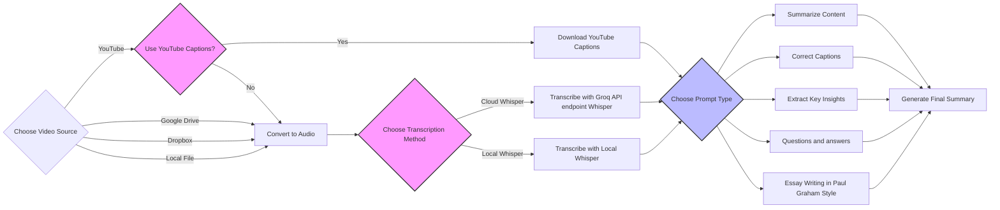

## Video Transcript Summarization with AI

Transcribe and summarize videos from multiple sources using state-of-the-art AI models in Google Colab or locally. This tool addresses the problem of too much content and too little time, helping you remember the content you watch or listen to.

https://github.com/user-attachments/assets/db89ec4e-90f1-46b3-a944-f65e78f66496

## Features

- **Versatile Video Sources**: Summarize videos from YouTube, Dropbox, Google Drive, or local files.
- **Efficient Transcription**:
  - Use existing YouTube captions when available to save time and resources.
  - Transcribe audio using **Cloud Whisper** (via Groq API) or **Local Whisper**.
- **Customizable Summarization**:
  - Choose from different prompt types: **Summarization**, **Grammar Correction**, or **Distill Wisdom** to extract key insights.
- **Flexible API Integration**:
  - Use various AI models via Groq (free), OpenAI, or custom local models for summarization.
- **Output Features**:
  - Generate summaries with timestamps and include original transcripts.

## Use Cases

- **Quick Summaries**: Get concise summaries of lengthy videos with timestamps.
- **Note-Taking**: Capture key points efficiently.
- **Transcription Correction**: Obtain grammatically correct video transcripts.
- **Wisdom Extraction**: Extract key insights and wisdom from any video content.

[Example Summary](Video%20summaries%20examples/ngvOyccUzzY_captions_FINAL.md)

## Usage

1. **API stuff**:
     - Set `api_endpoint` to **Groq**, **OpenAI**, or **Custom**.
     - Ensure `api_key` is set accordingly.
     - **Groq API Key** (`api_key_groq`): Required for **cloud Whisper** transcription.
     - If you plan to use Whisper API endpoint (only Groq endpoint is supported for now) you have to specify your Groq API key in api_key_groq.
     - Why use `api_key_groq` and `api_key` ? So that you can use a different API for summarization (e.g., OpenAI).
2. **Configure Runtime Environment**:
   - If using **Local Whisper** on Google Colab:
     - Switch the runtime type to a GPU instance (e.g., T4).
     - Go to **Runtime** > **Change runtime type** > Set **Hardware accelerator** to **GPU**.
3. **Input Video Source**:
   - Input the video URL or file path.
    - Select the source type (YouTube Video, Google Drive Video Link, Dropbox Video Link, Local File):
      - For Google Drive, use the path relative to "My Drive".
      - For Dropbox, use the public sharing link. 
      - For Youtube video, is recommended to use the available YouTube captions to save on transcription time and API usage.
4. **Set Transcription Settings**:
   - **The transcription settings are applied only if you want to use Whisper transcription and not Youtube Captions.**
   - Choose between cloud (Groq endpoint) or local Whisper:
     - **Cloud Whisper**:
       - Only supported via the **Groq** endpoint.
       - Requires `api_key_groq`.
     - **Local Whisper**:
       - Requires a GPU runtime.
   - **Language**: Specify the language code (ISO-639-1 format, e.g., "en" for English,"it" for Italian).
   - **Initial Prompt for Whisper**: (Optional) Provide an initial prompt to guide the transcription.
    - Groq **Free** usage transcription limits using Whisper:

      | Model ID                      | Requests per Day | Audio Minutes per Hour | Audio Minutes per Day |
      |-------------------------------|------------------|------------------------|-----------------------|
      | `distil-whisper-large-v3-en`  | 2,000            | 120                    | 480                   |
      | `whisper-large-v3`            | 2,000            | 120                    | 480                   |

5. **Set Summarization Settings**:
   - **Prompt Type**: Choose from **Summarization**, **Grammar Correction**, **Distill Wisdom**, **Questions and answers** or **Essay Writing in Paul Graham Style**.
   - Configure other settings such as **Parallel API Calls** (mind rate limits), **Chunk Size**, and **Max Output Tokens**.
