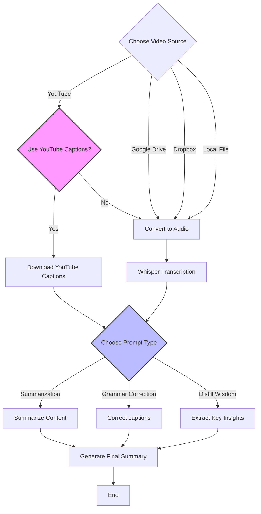

## Video Transcript Summarization with AI

Transcribe and summarize videos from multiple sources using state-of-the-art AI models in Google Colab or locally.
It addresses the problem of too much content and too little time, helping to remember the stuff you watch or listen to.
 
https://github.com/user-attachments/assets/db89ec4e-90f1-46b3-a944-f65e78f66496

## Features

- Summarize videos from YouTube, Dropbox, Google Drive, or local files
- Provide summaries with timestamps and original transcripts
- Use various AI models via Groq (free), OpenAI, or custom local models
- Support auto-generated captions (YouTube) and Whisper transcription

## Use Cases
- Quick summaries of lengthy videos with timestamps
- Efficient note-taking with key point capture
- Grammatically correct video transcripts
- Extracts wisdom from any video content that can be translated into text

[Example Summary](Video%20summaries%20examples/ngvOyccUzzY_captions_FINAL.md)

## Colab Usage

1. Obtain API key from Groq or OpenAI
2. Input API key into Colab Secrets 🗝️
3. Use T4 GPU for Faster Whisper
4. Input video URL and select source type
5. Run required cells
6. Access summaries and transcripts via Colab file explorer

Note: For Google Drive, use path relative to "My Drive". For Dropbox, use public sharing link.

