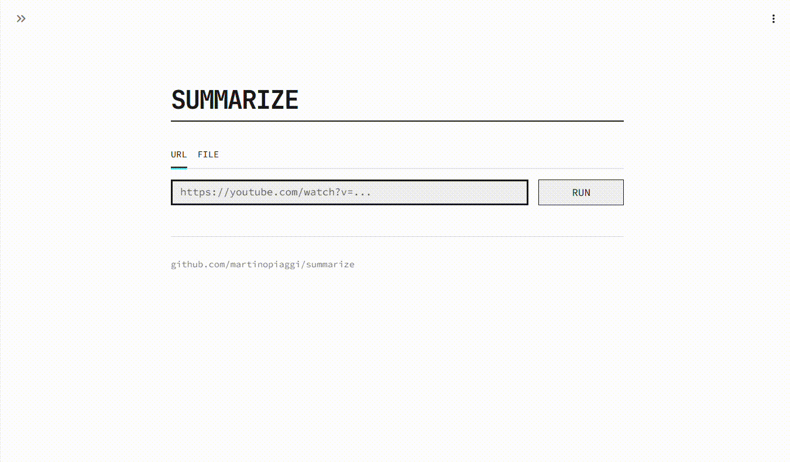

# Video Transcript Summarizer

<p align="center">
    
</p>

Transcribe and summarize videos from YouTube, Instagram, TikTok, Twitter, Reddit, Facebook, Google Drive, Dropbox, and local files.

Works with any OpenAI-compatible LLM provider, including locally hosted endpoints.

## Interfaces

| Interface | Command |
|-----------|---------|
| CLI | `python -m summarizer --source <source>` |
| Streamlit GUI | `python -m streamlit run app.py` |
| Docker | `docker compose up -d` -> `http://localhost:8501` |
| Agent skill | [`.agent/skills/summarize/SKILL.md`](./.agent/skills/summarize/SKILL.md) for agent access to the CLI |

## How It Works

```
               +--------------------+
               |  Video URL/Path    |
               +---------+----------+
                         |
                         v
               +---------+----------+
               |    Source Type?    |
               +---------+----------+
                         |
                         v
               +---------+----------+
               | Transcript Cache   |------> HIT -------+
               +---------+----------+                   |
                         | MISS                         |
       +-----------------+-------------+                |
       |                 |             |                |
       |          IG/TikTok/X    Local File            |
    YouTube       Reddit/FB      Google Drive          |
       |          other URLs      Dropbox               |
       |                 |             |                |
       v            +----+-----+       |                |
+------+----------+ | yt-dlp / |       |                |
| Captions Exist? | | Cobalt   |       |                |
+----+----+-------+ +----+-----+       |                |
    Yes   No             |             |                |
     |    +--------------+--------+----+                |
     |                            |                     |
     |                            v                     |
     |                   +--------+--------+            |
     |                   |     Whisper     |            |
     |                   |    endpoint?    |            |
     |                   +--------+--------+            |
     |                            |                     |
     |                +-----------+-----------+         |
     |                |                       |         |
     |           Cloud Whisper          Local Whisper   |
     |                |                       |         |
     |                +----------+------------+         |
     |                           |                      |
     +---------------------------+                      |
                                 |                      |
                           store in cache               |
                                 |                      |
                                 +----------------------+
                                 |
                            Transcript
                                 |
                                 v
                    +------------+----------+
 summarizer.yaml -> |    Prompt + LLM       |
 prompts.json    -> |    Merge              |
 .env            -> +------------+----------+
                                 |
                                 v
                          +------+-------+
                          |    Output    |
                          +--------------+
```

- `summarizer.yaml`: Local provider settings (`base_url`, `model`, `chunk-size`) and defaults such as `output-language`. Generate it with `python -m summarizer --init-config` or copy [`summarizer.example.yaml`](./summarizer.example.yaml).
- [`.env`](./.env): API keys matched by URL keyword
- [`prompts.json`](./summarizer/prompts.json): Summary style templates

**Notes:**
- Transcripts are **cached in memory** by default (keyed by SHA-256 of source + config). Re-summarizing the same video with a different style or provider skips transcription entirely. The cache lives in process memory and clears on exit. Disable with `cache-transcript: false` in `summarizer.yaml`.
- Cloud Whisper uses **Groq Cloud API** and requires a Groq API key
- Non-YouTube social URLs use **yt-dlp first** for Instagram, TikTok, X/Twitter, Reddit, and Facebook. Cobalt is still used as the fallback downloader for other HTTP video URLs.
- The Docker image does **not** include Local Whisper and is aimed at lightweight VPS deployment

## Installation and Usage

**Step 0 - CLI installation:**

```bash
git clone https://github.com/martinopiaggi/summarize.git
cd summarize
pip install -e .
```

**Step 1 - Run the CLI:**

```bash
python -m summarizer --source "https://youtube.com/watch?v=VIDEO_ID"
```

The summary is saved to `summaries/watch_YYYYMMDD_HHMMSS.md`.

### Streamlit GUI

```bash
python -m streamlit run app.py
```

Visit port 8501.

### Docker

```bash
git clone https://github.com/martinopiaggi/summarize.git
cd summarize
# Create .env with your API keys and summarizer.yaml with your providers, then:
docker compose up -d
```

Open `http://localhost:8501` for the GUI. Summaries are saved to `./summaries/`.
The CLI and GUI both read the same local `summarizer.yaml`.

CLI via Docker: `docker compose run --rm summarizer python -m summarizer --source "URL"`

Cobalt standalone: `docker compose -f docker-compose.cobalt.yml up -d`

## Configuration

### Providers (`summarizer.yaml`)

Define your LLM providers and defaults. CLI flags override everything. See [`summarizer.example.yaml`](./summarizer.example.yaml) for a complete starter file.

```yaml
# example of summarizer.yaml
default_provider: gemini

providers:
  gemini:
    base_url: https://generativelanguage.googleapis.com/v1beta/openai
    model: gemini-flash-lite-latest
    chunk-size: 128000

  groq:
    base_url: https://api.groq.com/openai/v1
    model: openai/gpt-oss-20b

  ollama:
    base_url: http://localhost:11434/v1
    model: qwen3:8b

  openrouter:
    base_url: https://openrouter.ai/api/v1
    model: openai/gpt-oss-20b

# example of a second config on the same provider
  openrouter120:
    base_url: https://openrouter.ai/api/v1
    model: openai/gpt-oss-120b

  openai:
    base_url: https://api.openai.com/v1
    model: gpt-5.5

  nvidia:
    base_url: https://integrate.api.nvidia.com/v1
    model: nvidia/nemotron-3-nano-omni-30b-a3b-reasoning

  perplexity:
    base_url: https://openrouter.ai/api/v1
    model: perplexity/sonar
    chunk-size: 128000

defaults:
  prompt-type: Questions and answers
  chunk-size: 10000
  parallel-calls: 30
  max-tokens: 4096
  output-language: auto
  audio-speed: 1.0
  use-proxy: false
  output-dir: summaries
  cache-transcript: true
```

`output-language` controls the language of the generated summary. Use `auto`, `none`, or an empty value to leave the model prompt unchanged. Use a human-readable language name such as `Italian`, `Spanish`, `German`, or `Japanese` to force summaries into that language.

### API Keys (`.env`)

```ini
# Required for Cloud Whisper transcription
groq = gsk_YOUR_KEY

# LLM providers (choose one or more)
openai = sk-proj-YOUR_KEY
generativelanguage = YOUR_GOOGLE_KEY
deepseek = YOUR_DEEPSEEK_KEY
openrouter = YOUR_OPENROUTER_KEY
perplexity = YOUR_PERPLEXITY_KEY
hyperbolic = YOUR_HYPERBOLIC_KEY
NVIDIA_API_KEY = YOUR_NVIDIA_KEY

# Optional: Webshare credentials
# Used only when `defaults.use-proxy: true` or `--use-proxy` is enabled
WEBSHARE_PROXY_USERNAME = YOUR_WEBSHARE_USERNAME
WEBSHARE_PROXY_PASSWORD = YOUR_WEBSHARE_PASSWORD

# Optional: yt-dlp authentication for social platforms
# Cookies are preferred for 2FA accounts. Use a Netscape cookies.txt export.
INSTAGRAM_COOKIES_FILE = C:\path\to\instagram-cookies.txt
YTDLP_COOKIES_FILE = C:\path\to\cookies.txt

# Optional: Instagram username/password login when cookies are not used
INSTAGRAM_USER = YOUR_INSTAGRAM_USERNAME
INSTAGRAM_PASS = YOUR_INSTAGRAM_PASSWORD
```

If you pass an endpoint URL with `--base-url`, the API key is matched from `.env` by URL keyword. For example, `https://generativelanguage.googleapis.com/...` matches `generativelanguage`.

### Prompts ([`prompts.json`](./summarizer/prompts.json))

Use with `--prompt-type` in the CLI or select it from the dropdown in the web interface.
Add custom styles by editing [`prompts.json`](./summarizer/prompts.json). Use `{text}` as the transcript placeholder.

### CLI Examples

With a configured local `summarizer.yaml`, the CLI is simple:

```bash
# Uses the default provider from YAML
python -m summarizer --source "https://youtube.com/watch?v=VIDEO_ID"

# Specify a provider
python -m summarizer --source "https://youtube.com/watch?v=VIDEO_ID" --provider groq

# Fact-check claims with Perplexity (use the Summarize skill for AI agents)
python -m summarizer \
  --source "https://youtube.com/watch?v=VIDEO_ID" \
  --base-url "https://api.perplexity.ai" \
  --model "sonar-pro" \
  --prompt-type "Fact Checker"

# Extract key insights
python -m summarizer \
  --source "https://youtube.com/watch?v=VIDEO_ID" \
  --provider gemini \
  --prompt-type "Distill Wisdom"

# Generate a Mermaid diagram
python -m summarizer \
  --source "https://youtube.com/watch?v=VIDEO_ID" \
  --provider openrouter \
  --prompt-type "Mermaid Diagram"

# Use NVIDIA NIM (audio-only default)
python -m summarizer \
  --source "https://youtube.com/watch?v=VIDEO_ID" \
  --provider nvidia

# Use NVIDIA NIM with visual mode
python -m summarizer \
  --source "https://youtube.com/watch?v=VIDEO_ID" \
  --provider nvidia \
  --visual

# Multiple videos
python -m summarizer --source "URL1" "URL2" "URL3"

# Local files
python -m summarizer --type "Local File" --source "./lecture.mp4"

# Speed up audio before Whisper (faster, may reduce accuracy)
python -m summarizer --source "URL" --force-download --audio-speed 2.0

# Aggressive speed-up (supported)
python -m summarizer --source "URL" --force-download --audio-speed 5.0

# Force YouTube audio download and show detailed progress
python -m summarizer \
  --source "https://youtube.com/watch?v=VIDEO_ID" \
  --force-download \
  -v

# Non-YouTube social URL
# Instagram, TikTok, X/Twitter, Reddit, and Facebook use yt-dlp first.
# Other HTTP video URLs fall back to Cobalt.
python -m summarizer --type "Video URL" --source "https://www.instagram.com/reel/..."

# Let captions/transcription choose the language automatically (default)
python -m summarizer --source "URL" --language "auto"

# Lock YouTube captions or transcription to a specific language
python -m summarizer --source "URL" --prompt-type "Distill Wisdom" --language "it"

# Write the summary in a specific language
python -m summarizer --source "URL" --output-language "Italian"
```

Without YAML, pass `--base-url` and `--model` explicitly:

```bash
python -m summarizer \
  --source "https://youtube.com/watch?v=VIDEO_ID" \
  --base-url "https://generativelanguage.googleapis.com/v1beta/openai" \
  --model "gemini-2.5-flash-lite"
```

#### CLI Reference

| Flag | Description | Default |
|------|-------------|---------|
| `--source` | Video URLs or file paths (multiple allowed) | Required |
| `--provider` | Provider name from YAML | `default_provider` |
| `--base-url` | API endpoint (overrides provider) | From YAML |
| `--model` | Model identifier (overrides provider) | From YAML |
| `--api-key` | API key (overrides [`.env`](./.env)) | - |
| `--type` | `YouTube Video`, `Video URL`, `Local File`, `Google Drive Video Link`, `Dropbox Video Link`, `TXT` | `YouTube Video` |
| `--prompt-type` | Summary style | `Questions and answers` |
| `--chunk-size` | Input text chunk size in characters | `10000` |
| `--force-download` | Skip captions and download audio instead | `False` |
| `--transcription` | `Cloud Whisper` (Groq API) or `Local Whisper` (local) | `Cloud Whisper` |
| `--whisper-model` | `tiny`, `base`, `small`, `medium`, `large` | `tiny` |
| `--audio-speed` | Pre-transcription playback speed | `1.0` |
| `--language` | `auto` picks the first available YouTube caption track and lets Whisper detect language; explicit codes stay strict | `auto` |
| `--output-language` | Language for the generated summary; use `auto`, `none`, or empty to leave the prompt unchanged | `auto` |
| `--parallel-calls` | Concurrent API requests | `30` |
| `--max-tokens` | Max output tokens per chunk | `4096` |
| `--cobalt-url` | Cobalt base URL for fallback downloads after YouTube/yt-dlp handlers do not match or fail | `http://localhost:9000` |
| `--output-dir` | Output directory | `summaries` |
| `--no-save` | Print only, no file output | `False` |
| `--verbose`, `-v` | Detailed output | `False` |
| `--visual` | Send video directly to a video-capable model (skips transcription; chunks long videos when needed) | `False` |

Use `--verbose` to see detailed status output during config loading, downloads, transcription, and summarization.

## Visual Mode

By default, the app transcribes audio and summarizes the transcript. Visual mode skips transcription entirely and sends video (including audio and visual content) directly to a video-capable model. If a provider has a short per-request video window, the app splits the video into timestamped temporal chunks and sends each chunk as video.

**Supported providers (MVP):**
- **NVIDIA**: `nvidia/nemotron-3-nano-omni-30b-a3b-reasoning` via `https://integrate.api.nvidia.com/v1`

Visual mode is opt-in and does **not** change the default audio-only behavior. It also does not use the transcript cache because it bypasses transcription completely.

**CLI examples:**

```bash
# YouTube video via NVIDIA visual mode
python -m summarizer --source "https://youtube.com/watch?v=VIDEO_ID" --provider nvidia --visual

# Local file via NVIDIA visual mode
python -m summarizer --type "Local File" --source "./clip.mp4" --provider nvidia --visual
```

**Visual limits (NVIDIA MVP):**
- Maximum duration per request: 120 seconds
- Maximum file size: 100 MB
- Supported formats: MP4, MOV, WEBM

Long NVIDIA visual runs are split automatically. For example, an 820 second video becomes seven visual requests: six 120 second chunks and one 100 second chunk. The final output is timestamped by segment.

You can enable automatic compression in `summarizer.yaml`:

```yaml
defaults:
  visual-compression: auto
  visual-chunk-seconds: auto
  visual-chunk-overlap-seconds: 0
  visual-synthesis: false
```

Or override limits/chunking per-provider when known:

```yaml
defaults:
  visual-max-size-mb: 200
  visual-max-duration-seconds: 300
  visual-chunk-seconds: 100
```

`chunk-size` remains text-only and is ignored in visual mode.

## Extra

### Local Whisper

Runs transcription on your machine instead of using Groq Cloud Whisper. This removes the Groq API requirement, but CPU-only runs are much slower.

```bash
# Add Local Whisper support
pip install -e .[whisper]

# Optional: install CUDA-enabled PyTorch for GPU acceleration
pip install torch torchvision torchaudio --index-url https://download.pytorch.org/whl/cu124

# Use it
python -m summarizer --source "URL" --force-download --transcription "Local Whisper" --whisper-model "small"
```

If you only need CPU transcription, `pip install -e .[whisper]` is enough.

**Why not in Docker?** The Docker image installs the core app only. It does not include `openai-whisper` or GPU-oriented PyTorch because this project targets lightweight VPS deployments, where GPUs are usually unavailable. In Docker, Cloud Whisper is the practical default. Use Local Whisper on the host machine if you have the hardware for it.

Model sizes: `tiny` (fastest) / `base` / `small` / `medium` / `large` (most accurate). GPU detection is automatic when PyTorch can see a CUDA device.

### Proxy Setup

Proxy support matters in three separate places:

1. The Python app, when fetching YouTube transcripts or downloading YouTube audio with `pytubefix`
2. The Python app, when downloading supported social URLs with `yt-dlp`
3. The Cobalt container, when it connects to upstream CDNs/providers

For the Python app, this repo expects **Webshare** credentials:

1. Add credentials to [`.env`](./.env):

```ini
WEBSHARE_PROXY_USERNAME = YOUR_WEBSHARE_USERNAME
WEBSHARE_PROXY_PASSWORD = YOUR_WEBSHARE_PASSWORD
```

2. If you want `pytubefix` audio downloads to use that proxy, enable it in `summarizer.yaml`:

```yaml
defaults:
  use-proxy: true
```

Notes:

- YouTube transcript fetching uses Webshare automatically when those credentials are present.
- `defaults.use-proxy: true` affects `pytubefix` and `yt-dlp` audio downloads.
- yt-dlp authentication is independent from Webshare proxy settings.
- Host-specific cookie files such as `INSTAGRAM_COOKIES_FILE` win over `YTDLP_COOKIES_FILE`.
- Cookie-file authentication wins over username/password authentication.

For the Cobalt container, the proxy is configured separately. That sits outside the Python app, but this repo includes a working example:

- [docker-compose.yml](./docker-compose.yml) is the default full-stack setup
- [docker-compose.cobalt.yml](./docker-compose.cobalt.yml) runs only Cobalt
- [docker-compose.proxy.yml](./docker-compose.proxy.yml) adds `./cobalt.proxy.env` to the `cobalt` service
- [cobalt.proxy.env.example](./cobalt.proxy.env.example) is the template
- `cobalt.proxy.env` is your local, ignored secrets file

Docker examples:

```powershell
# Cobalt only, no proxy
docker compose -f docker-compose.cobalt.yml up -d

# Cobalt only, with proxy
docker compose -f docker-compose.cobalt.yml -f docker-compose.proxy.yml up -d

# Full stack, no proxy
docker compose up -d

# Full stack, with proxy
docker compose -f docker-compose.yml -f docker-compose.proxy.yml up -d
```

## License

This project is licensed under the MIT License. See the [LICENSE](LICENSE) file for details.
