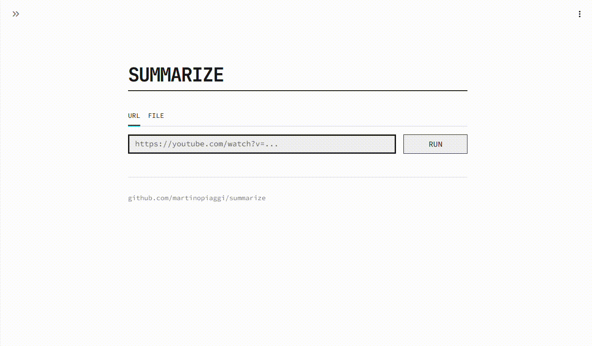

# Video Summarizer

<p align="center">
    
</p>

<p align="center">
  <a href="https://summarize.martino.im"><strong>Documentation</strong></a> ·
  <a href="https://github.com/martinopiaggi/summarize/stargazers"></a>
</p>

**Local-first, multi-source video summarization** for YouTube, social platforms, cloud drives, and local files. Works with any OpenAI-compatible LLM, supports an optional vision path, and includes NotebookLM-style workflows.

> **Not [steipete/summarize](https://github.com/steipete/summarize).** This project is a self-hosted video pipeline with transcript caching, Cobalt fallback, a Streamlit workspace, and an agent skill. [steipete/summarize](https://github.com/steipete/summarize) is a generic URL clipper.

Bring your own API keys. Configuration lives in `summarizer.yaml` and `.env`. Full documentation: **[summarize.martino.im](https://summarize.martino.im)**.

## Features

- **11+ sources** — YouTube, Instagram, TikTok, X/Twitter, Reddit, Facebook, Google Drive, Dropbox, and local files
- **Any LLM** — OpenAI, Groq, Gemini, Ollama, OpenRouter, NVIDIA, Perplexity, LiteLLM, and other OpenAI-compatible endpoints
- **Two modes** — Transcript-based summarization (default) or visual mode with vision-capable models
- **Summary styles** — Q&A, distillation, fact-checking, tutorials, Mermaid diagrams, essays, and custom prompts via `summarizer/prompts.json`
- **Multiple interfaces** — CLI, Streamlit UI, HTTP API, Docker, Raycast extension, and agent skill
- **Transcript cache** — Reuse cached transcripts across runs; optional Cobalt sidecar for yt-dlp fallbacks

## Requirements

- **Python** 3.7+
- **ffmpeg** on `PATH`
- At least one **LLM API key** in `.env`
- **Cobalt** (optional, included in Docker Compose) for URLs that yt-dlp cannot handle

## Installation

Summarizer is a CLI application. Install it in an **isolated environment** so upgrades to other Python tools (groq, litellm, openai, MCP servers, etc.) cannot break it. The most common failure mode is a `pydantic` / `pydantic-core` version mismatch when many packages share one `~/.local` site-packages directory.

| Method | Best for |
|--------|----------|
| **pipx** (recommended) | CLI, HTTP API, and day-to-day use |
| **venv** | Development or a manually managed environment |
| **pip install --user** | Quick try only — can conflict with other tools in `~/.local` |
| **Docker** | Streamlit GUI with no local Python dependencies |

```bash
# Recommended — isolated app environment
pipx install martino-summarize

# HTTP API (includes FastAPI + uvicorn)
pipx install "martino-summarize[server]"

# Everything: server + local Whisper + LiteLLM
pipx install "martino-summarize[all]"
```

Alternative with a virtual environment:

```bash
python3 -m venv ~/summarizer-venv
source ~/summarizer-venv/bin/activate   # Windows: ~/summarizer-venv\Scripts\activate
pip install "martino-summarize[server]"
```

## Quick Start

Set an OpenAI-compatible API key in `.env`. [Groq](https://groq.com/) (`GROQ_API_KEY`) offers a free tier; `OPENAI_API_KEY` works with `--provider openai`.

```bash
pipx install martino-summarize
summarizer --init-config
echo "GROQ_API_KEY=your_key_here" > .env
summarizer --source "https://www.youtube.com/watch?v=arj7oStGLkU"
```

Summaries are saved to `summaries/watch_YYYYMMDD_HHMMSS.md`.

### Docker

```bash
git clone https://github.com/martinopiaggi/summarize.git
cd summarize
cp summarizer.docker.yaml summarizer.yaml   # Docker-optimized defaults
echo "GROQ_API_KEY=your_key_here" > .env     # or OPENAI_API_KEY, etc.
docker compose up -d
```

Open **http://localhost:8501**, paste a URL, and summarize. GUI summaries and transcript cache persist under `./summaries/` (including `.cache/transcripts/`).

Pre-built image:

```bash
docker pull ghcr.io/martinopiaggi/summarize:latest
```

Compose variants:

```bash
docker compose up -d                                              # + Cobalt sidecar
docker compose -f docker-compose.gui-only.yml up -d               # YouTube-only
docker compose -f docker-compose.yml -f docker-compose.named-volume.yml up -d  # named volume
```

`docker-compose.yml` mounts `.env`, `summarizer.yaml`, and `./summaries/`. Cobalt runs as a sidecar for TikTok, Instagram, and other yt-dlp fallbacks.

## Interfaces

| Interface | Command |
|-----------|---------|
| **Streamlit GUI** | `docker compose up -d` → `http://localhost:8501` |
| **CLI** | `summarizer --source <source>` |
| **HTTP API** | `pipx install "martino-summarize[server]"` then `summarizer serve` → `http://localhost:8000/docs` |
| **Docker** | `docker compose up -d` |
| **Agent Skill** | [`.agent/skills/summarize/SKILL.md`](./.agent/skills/summarize/SKILL.md) |
| **Raycast** | [`extensions/raycast-summarize/`](./extensions/raycast-summarize/) |

## How It Works

- **Transcript path** (default): downloads audio or video, transcribes with Whisper or captions, caches the transcript, then summarizes with an LLM.
- **Visual path** (`--visual`): sends the video directly to a vision-capable model, skipping transcription. Uses the same prompts, provider config, and `.env` keys as the transcript path. Supports `base64` chunks (default) and `url` passthrough for YouTube.

Full pipeline diagram: [summarize.martino.im/how-it-works](https://summarize.martino.im/how-it-works)

## Troubleshooting

| Issue | Resolution |
|-------|------------|
| `pydantic-core` version mismatch on `summarizer serve` | Not a summarizer bug — your Python environment has mismatched packages. Fix: `pip install --upgrade pydantic pydantic-core`, or reinstall in isolation: `pipx install "martino-summarize[server]"` |
| `Server dependencies not installed` on `serve` | Install the server extra: `pipx install "martino-summarize[server]"` or `pip install "martino-summarize[server]"` inside a venv |
| Strange import errors after upgrading other tools | Reinstall in an isolated environment (`pipx` or a dedicated venv) instead of shared `~/.local` site-packages |
| yt-dlp or platform errors | Ensure Cobalt is running (`docker compose` includes it) or set `COBALT_BASE_URL` |
| Missing API key | Add the provider key to `.env` (see `summarizer.example.yaml` for provider names) |
| No config file | Run `summarizer --init-config` or pass `--base-url` and `--model` with `--no-config` |
| ffmpeg not found | Install ffmpeg and ensure it is on your `PATH` |

Full guide: [summarize.martino.im](https://summarize.martino.im)

## Contributing

```bash
git clone https://github.com/martinopiaggi/summarize.git
cd summarize
pip install -e ".[all]"
pip install pytest
pytest tests/
```

See [CONTRIBUTING.md](CONTRIBUTING.md).

## License

[MIT](LICENSE)