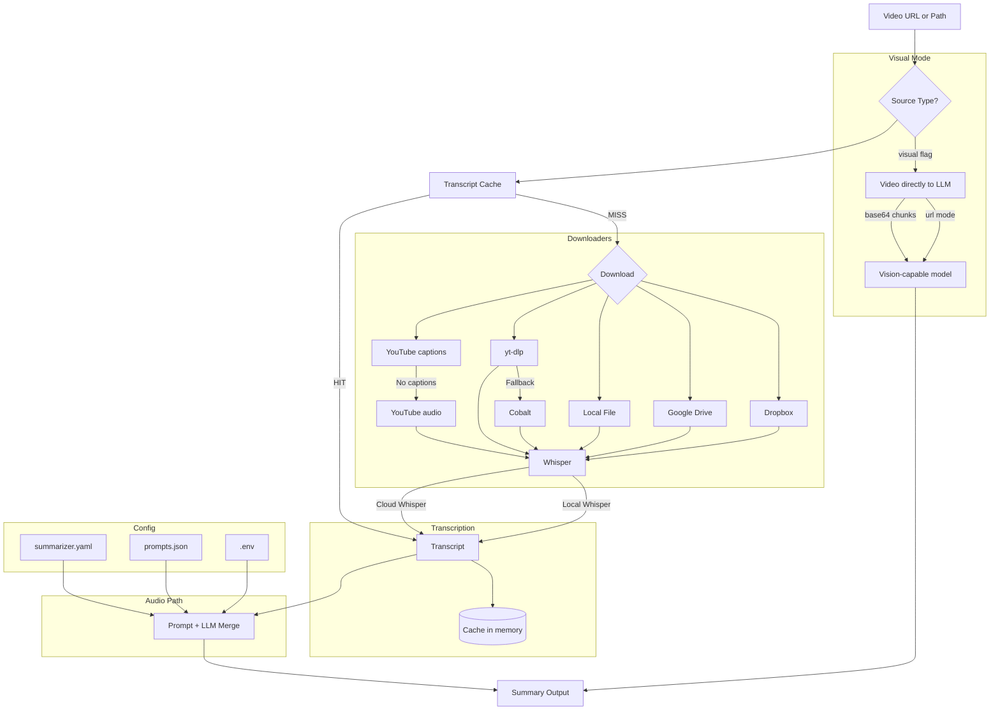

# How It Works

## Download Pipeline

The app uses a **fallback downloader chain**:

1. **YouTube** (`pytubefix`) — captions first, then audio download
2. **yt-dlp** — Instagram, TikTok, Twitter/X, Reddit, Facebook
3. **Cobalt** — fallback for other HTTP video URLs

If a downloader does not support a URL or fails, the next one is tried automatically.

## Key Files

| File | Purpose |
|------|---------|
| `summarizer.yaml` | Provider settings and defaults. Generate with `python -m summarizer --init-config`. |
| `.env` | API keys matched by URL keyword or conventional env var names |
| `summarizer/prompts.json` | Summary style templates |

## Notes

> **Tip:** If YouTube captions are unavailable, the tool automatically falls back to audio download + Whisper transcription.
>
> **Tip:** Transcripts are cached in memory by default. Re-summarizing the same source with a different style or provider skips transcription entirely. Disable with `cache-transcript: false` in `summarizer.yaml`.

- Cloud Whisper uses **Groq Cloud API** and requires a Groq API key.
- The Docker image does **not** include Local Whisper and is aimed at lightweight VPS deployment.
